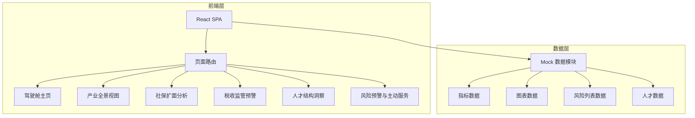
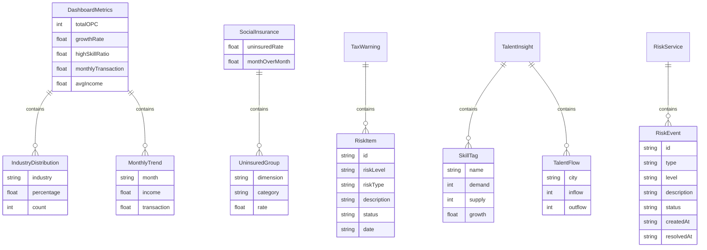

## 1. 架构设计

## 2. 技术说明

- **前端**：React@18 + TypeScript + Tailwind CSS@3 + Vite
- **初始化工具**：vite-init (react-ts 模板)
- **后端**：无（纯前端 Demo，使用 Mock 数据）
- **数据库**：无（使用内存中的 Mock 数据）
- **图表库**：recharts（轻量 React 图表库）
- **状态管理**：zustand
- **路由**：react-router-dom
- **图标**：lucide-react

## 3. 路由定义

| 路由 | 用途 |
|------|------|
| / | 驾驶舱主页，展示核心指标卡和模块导航 |
| /panorama | 产业全景视图详情页 |
| /social-insurance | 社保扩面分析详情页 |
| /tax-warning | 税收监管预警详情页 |
| /talent | 人才结构洞察详情页 |
| /risk-service | 风险预警与主动服务详情页 |

## 4. API 定义

无后端 API，所有数据通过 Mock 数据模块提供。

## 5. 服务器架构图

不适用（纯前端项目）

## 6. 数据模型

### 6.1 数据模型定义

### 6.2 数据定义语言

不适用（使用 TypeScript 类型定义 + Mock 数据）
